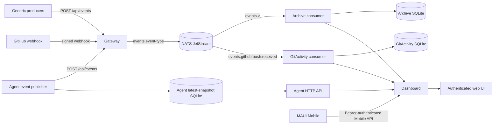
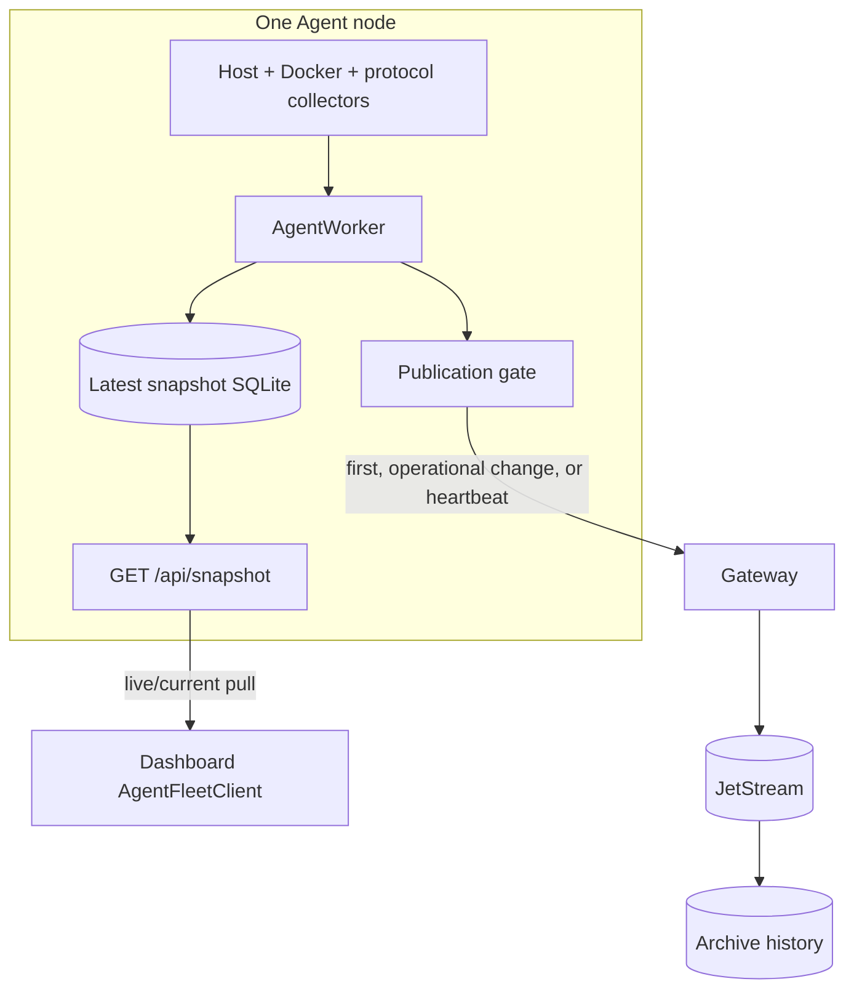
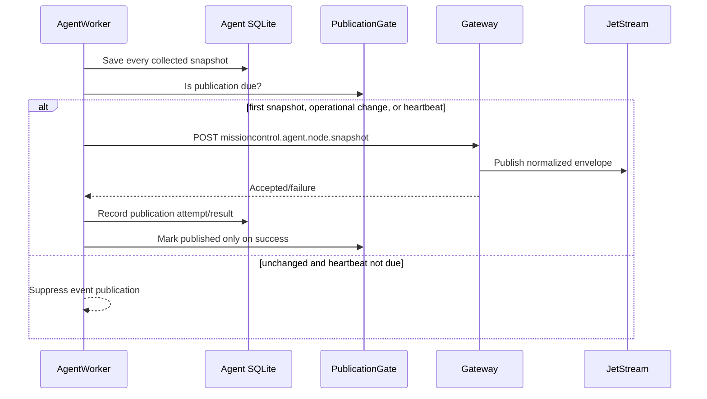
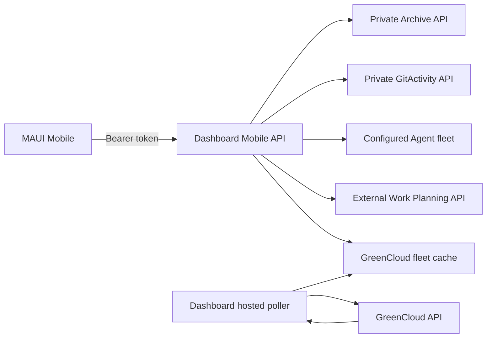

# Mission Control architecture

This document describes the implementation on the `dev` branch as inspected in September 2026. It describes current behavior, including compatibility surfaces; it is not a target-state design.

## System purpose

Mission Control combines two kinds of operational information:

1. Durable integration events are authenticated at Gateway, published through NATS JetStream, and consumed into purpose-specific SQLite stores.
2. Live infrastructure state is collected and retained by each Agent, then queried directly by Dashboard.

Dashboard presents both kinds of information to authenticated web users and is the authenticated server boundary for the Mobile app.

## Top-level structure

The event and live-state paths intersect at the user interface, not at one central Agent-state database.

## Projects and responsibilities

### Gateway

`MissionControl.Gateway` is the public event-ingress service.

- `POST /api/events` accepts a `PublishEventRequest` authenticated by one configured `X-Mission-Control-Key`. The key resolves the event source on the server; callers do not select their own source identity.
- The endpoint validates the event ID, type, schema version, occurrence time, and object payload, creates an `IntegrationEventEnvelope` with a server receive time, and returns `202 Accepted` after publication.
- The optional GitHub webhook endpoint verifies the GitHub signature and required headers, enforces the configured owner and payload limit, and normalizes supported webhook data into Mission Control events.
- Gateway exposes liveness/readiness checks. Readiness includes JetStream availability.

Gateway does not archive events itself and does not own current Agent state.

### NATS JetStream and messaging

`MissionControl.Messaging` defines the broker-independent `IEventPublisher` and `IIntegrationEventProcessor` boundaries. `MissionControl.Messaging.Nats` implements them with NATS.

The configured stream is `MISSION_CONTROL_EVENTS` by default and covers `events.>`. The current initializer uses file storage, limits retention, discard-old behavior, a seven-day maximum age, a 256 MiB maximum size, and one replica. Publishers use `events.{EventType}` and the envelope event ID as the JetStream message ID for broker-level duplicate suppression.

Consumers are durable and independently configured:

| Consumer | Typical filter | Purpose |
| --- | --- | --- |
| Archive | `events.>` | Retain complete event envelopes. |
| GitActivity | `events.github.push.received` | Build the allowed GitHub activity projection. |

Consumers use explicit acknowledgements and one outstanding message at a time. Successful processing sends ACK. A malformed envelope or `PermanentIntegrationEventException` sends TERM. Other processing failures send a delayed NAK and may be redelivered up to `NatsConsumer:MaxDeliveries`. The consume loop reconnects/restarts after infrastructure failures.

### Archive

`MissionControl.Archive` is both a durable JetStream consumer and an HTTP query service.

- `ArchivingIntegrationEventProcessor` stores the complete envelope in SQLite and treats a repeated event ID as a duplicate rather than a second event.
- Query endpoints provide recent complete events, a summary feed with a stable three-part cursor, event details, and statistics.
- SQLite, JetStream, and consumer status participate in readiness.

The Archive API has no application-level authentication in this service. The deployed service is expected to remain on an appropriately controlled network. Dashboard is its normal UI/API consumer.

### GitActivity

`MissionControl.GitActivity` consumes only normalized GitHub push events. It validates source, event type, and schema, ignores repositories and branches outside its allowlists, and upserts a commit-oriented SQLite projection. Its feed endpoint requires `X-Mission-Control-Key` and uses fixed-time key comparison.

Dashboard holds the GitActivity service URL and key. Mobile receives neither; it calls `GET /api/mobile/git-activity` on Dashboard.

### Agent

`MissionControl.Agent` is a per-machine background service and HTTP service.

- `AgentWorker` runs immediately at startup and then at `Agent:IntervalSeconds`.
- Host, Docker, and configured protocol probes are collected concurrently. Expected failure in one collector becomes partial/degraded snapshot data rather than discarding healthy collectors.
- Every completed snapshot is stored in the Agent's local SQLite database. The store retains latest node state, not a metrics time series.
- `GET /api/snapshot` serves a sanitized public snapshot. It returns `503` until a snapshot exists, applies staleness, CORS, and rate limiting, and can overlay freshly collected host metrics on the stored container/protocol snapshot.
- The optional Gateway client publishes selected snapshot events without making local persistence depend on publication success.

Docker collection targets a Unix socket by default and is disabled by default on Windows. Host CPU/memory detail is primarily Linux `/proc` based.

### Dashboard

`MissionControl.Dashboard` is an authenticated Blazor Server application and integration host.

It owns:

- local cookie authentication, user storage in SQLite, and persisted ASP.NET Data Protection keys;
- Archive, GitActivity, Agent fleet, Gateway publication, GreenCloud, and Work Planning clients;
- the runtime-reloadable service catalog;
- per-page Agent/event refresh controllers and last-known presentation behavior;
- the process-wide GreenCloud fleet polling cache;
- the bearer-authenticated Mobile API.

Dashboard pages use cookie authentication. Mobile API endpoints use the separate Mobile bearer scheme and return no-store responses. Upstream credentials remain server-side.

### Mobile

`MissionControl.Mobile` is a .NET MAUI Blazor Hybrid host. It stores the raw Dashboard Mobile API token in MAUI `SecureStorage` and attaches it as a bearer token to its Dashboard requests.

Mobile does not directly query Archive, GitActivity, Agent nodes, GreenCloud, or Work Planning. It uses Dashboard endpoints for:

- event feed, details, and statistics under `/api/events`;
- Git activity under `/api/mobile/git-activity`;
- host fleet state under `/api/mobile/hosts`;
- Work Planning under `/api/mobile/work-planning`;
- the retained single-server bandwidth compatibility route `/api/mobile/bandwidth`.

The host, home, and service experiences share a process-local Mobile fleet state and page polling around 30 seconds. Dashboard still performs the actual Agent requests.

### Contracts, Client, and shared UI

The shared layers have distinct roles:

| Layer | Owns | Does not own |
| --- | --- | --- |
| `MissionControl.Contracts` | Serialized event, Agent, Archive, GitHub/GitActivity, and service-definition shapes. | HTTP calls, authentication handlers, refresh state, Razor components. |
| `MissionControl.Client` | Typed HTTP clients and interfaces, client-facing infrastructure/Work Planning models, feed and refresh helpers. | Server credentials, persistence, app navigation, host-specific lifecycle. |
| `MissionControl.UI` | Shared Razor components, view models/presentation helpers, catalog-to-snapshot mapping, shared CSS theme. | Dashboard authentication/configuration and MAUI storage/device behavior. |

Dashboard and Mobile compose shared UI components inside their own pages and layouts. When behavior is truly common, it belongs in `UI` or `Client`; host-specific polling, DI, navigation, authentication, and disposal stay in the host.

The Mobile project includes `MissionControl.Dashboard/services.json` as a MAUI asset at build time. It therefore shares the catalog source file but not Dashboard's runtime reload process.

### Observability

`MissionControl.Observability` maps common live/ready endpoints and contains NATS health checks. Gateway readiness checks the stream. Archive and GitActivity additionally check their SQLite stores and durable consumer health. Agent exposes liveness separately.

## Live/current state versus durable/history state

These data classes must not be conflated:

| Concern | Source of truth | Retention and access |
| --- | --- | --- |
| Current host/container/protocol state | Each Agent's local latest snapshot | Queried directly from Agent HTTP APIs by Dashboard. |
| Current GreenCloud bandwidth | Dashboard's in-memory fleet cache | Refreshed by a Dashboard hosted service; read by Dashboard and Mobile host presentation. |
| Service metadata | Dashboard `services.json` / Mobile bundled copy | Configuration, correlated with current Agent data by `NodeId`. |
| Complete integration-event history | Archive SQLite | Fed durably from JetStream; queried through Archive/Dashboard. |
| Allowed GitHub activity projection | GitActivity SQLite | Fed durably from selected JetStream events. |
| Work Planning data | External Work Planning service | Queried/mutated through Dashboard's authenticated client. |

An archived Agent snapshot event is historical evidence that an event was published. It is not the Dashboard's live-state source and is not guaranteed to represent every Agent collection.

## Hybrid Agent architecture

The publication fingerprint includes node display identity, Docker availability, protocol success/endpoints, and container image/state/restart count. High-frequency resource values and diagnostic wording alone do not trigger publication. A failed publication remains eligible on a later collection.

This is intentionally hybrid:

- live/current state remains decentralized and directly queryable;
- meaningful Agent events enter the central durable event path;
- Mission Control does not centrally store or serve every Agent sample.

## Multi-node Agent fleet

Dashboard `Agents:Nodes` explicitly lists each node's stable `NodeId`, display name, and base URL. For example, Clanker and ScopeCreep are independent entries with independent Agent APIs.

`AgentFleetClient` requests all configured nodes concurrently with a bounded HTTP timeout. A node failure produces a per-node error rather than failing successful nodes. Page-level `AgentFleetRefreshController` instances merge a failed refresh with a previous good snapshot and recompute freshness at read time. A refresh gate prevents overlapping refreshes within one controller.

The configured fleet `NodeId` is the Dashboard join key. The Agent payload also carries its own `NodeId`, whose effective value is `Agent:NodeId` or, for compatibility, `Agent:NodeName`. Deployments should keep those identities aligned.

Dashboard pages normally refresh Agent state at `Dashboard:Refresh:AgentSnapshotRefreshSeconds`. `GET /api/mobile/hosts` also performs an Agent fleet fetch for the requesting Mobile refresh. Agent traffic is therefore request/page driven; unlike GreenCloud traffic, it is not one global Dashboard cache.

## Service catalog

Dashboard loads `MissionControl.Dashboard/services.json` as required configuration with reload-on-change. A valid reload replaces the catalog; an invalid reload leaves the last valid catalog active and surfaces a warning.

Each `ServiceDefinition.NodeId` owns placement. Catalog mapping:

1. Select definitions whose `NodeId` equals the chosen fleet node, case-insensitively.
2. Match `ContainerName` against containers from that node's snapshot.
3. Match `ProtocolServiceKey` against protocol results from that node's snapshot.
4. Present unmatched observations as uncatalogued for that node.

Service IDs are globally unique. Container names and protocol service keys are unique per node, so Clanker and ScopeCreep may use the same container/probe name without collision. The default `NodeId = "clanker"` remains for serialized/configuration compatibility; explicit node ownership is clearer for multi-node entries.

## Agent-to-Gateway event publication

Local snapshot storage continues whether Gateway publication is enabled, rejected, or unavailable.

## Mobile API boundary

The Dashboard Mobile token is configured as a SHA-256 hash; the installed app holds the raw token. The Dashboard proxy converts expected upstream failures into scoped, sanitized API errors and does not expose server API keys.

The Archive-backed Mobile routes happen to live under `/api/events` rather than `/api/mobile/events`, but they still require the Mobile authorization policy.

## GreenCloud bandwidth integration

GreenCloud fleet bandwidth is a Dashboard-hosted polling integration:

1. `GreenCloudBandwidthPollingService` attempts an initial refresh on Dashboard startup.
2. When enabled, it runs subsequent refreshes at `GreenCloud:PollSeconds` (300 seconds by default; validation permits 60–3600).
3. The singleton `GreenCloudBandwidthFleetRefreshController` serializes refreshes and atomically exposes the latest node results.
4. `GreenCloudBandwidthClient` queries configured provider server IDs and maps them to fleet `NodeId` values.
5. Dashboard Hosts and `GET /api/mobile/hosts` read `CurrentNodes`; neither initiates a fleet refresh.

Per-node refresh failures retain the previous snapshot when available and attach a bandwidth-specific error. A fleet-level expected failure retains prior snapshots and marks them with a refresh warning. Agent and GreenCloud work are not awaited together, so a slow or failed provider does not delay healthy Agent responses. One process-wide poller means concurrent Dashboard and Mobile access does not multiply provider fleet calls.

The cache is in memory. A Dashboard restart begins with placeholders until the startup refresh completes. It is latest-state presentation, not bandwidth history.

`GreenCloud:ServerId` and authenticated `GET /api/mobile/bandwidth` are retained single-server compatibility surfaces. That endpoint still invokes the provider directly. The active multi-node host presentation uses `GreenCloud:Servers[]` and the cached `/api/mobile/hosts` path.

## Work Planning integration

Work Planning is an external HTTP integration, not a JetStream consumer.

- Dashboard configures a server-side `IWorkPlanningClient` with `WorkPlanningApi:BaseUrl` and a bearer API key.
- Dashboard shared components/pages can use that client server-side.
- Mobile calls authenticated `/api/mobile/work-planning/*` routes.
- Dashboard forwards daily/random pick, work-item, and todo operations to the external service and converts expected upstream failures to `502` responses.

The Work Planning API key stays in Dashboard configuration and is never sent to Mobile.

## Configuration and secrets

Executables use standard .NET configuration sources. Nested environment-variable keys use `__`. Major sections include:

- Gateway: `EventSources`, `GitHubWebhook`, `Nats`.
- NATS consumers: `Nats` and `NatsConsumer`.
- Archive: `EventArchive`.
- GitActivity: `GitActivity`.
- Agent: `Agent`, `AgentApi`, `AgentStorage`, and `MissionControl`.
- Dashboard: `Archive`, `Agents`, `Dashboard`, `GitActivityApi`, `GreenCloud`, `MissionControl`, `ServiceCatalog` (from `services.json`), and `WorkPlanningApi`.

Options that affect identity, authentication, persistence, or upstream endpoints are validated at startup where validators are registered.

Checked-in settings must contain only safe defaults and placeholders. Keep event-source keys, webhook secrets, service API keys, GreenCloud tokens, Mobile token material, credentials, Android signing material, and deployment-specific private values in user secrets, environment variables, or the deployment secret provider. Do not place secrets in `services.json`, this document, logs, Mobile assets, or client responses.

Archive, Agent, Dashboard authentication/Data Protection, GitActivity, and JetStream files are operational state and require persistent storage appropriate to the deployment.

## Deployment boundary

This repository contains Dockerfiles for Gateway, Archive, Dashboard, GitActivity, and Agent. Production Docker Compose is maintained externally in `JoyfulReaper/UsefulScripts`, so this repository is not authoritative for production topology, mounts, networks, or which machines run each component.

`Dockerfile.agent` provides a way to build/deploy an Agent image. It does not imply that current production Agents—including example nodes such as Clanker and ScopeCreep—are necessarily containerized. An Agent that accesses a Docker socket has privileged host capability and must be deployed accordingly.

## Current architectural limitations

These are current boundaries, not promises of a redesign:

- Agent storage retains only the latest snapshot per node; no central historical metrics database exists.
- Agent events are sampled by operational-change/heartbeat publication and do not represent every collection.
- Dashboard live fleet state depends on direct network reachability to every configured Agent.
- Dashboard Agent refresh state is per page/request path rather than one process-wide Agent cache. Multiple Mobile clients can produce additional Agent reads.
- The GreenCloud fleet cache is process-local and loses last-known values on Dashboard restart.
- The retained single-server Mobile bandwidth compatibility endpoint bypasses the fleet cache and calls GreenCloud directly.
- Dashboard service catalog reloads at runtime, while Mobile receives its catalog only at build time.
- Archive and Agent query endpoints do not add their own application authentication; deployment network controls are part of their security boundary.
- JetStream retention is bounded, and SQLite services are single-service local stores rather than a shared relational platform.
- GitActivity is a filtered projection of supported push events, not a complete GitHub mirror.
- Production orchestration lives outside this repository.
